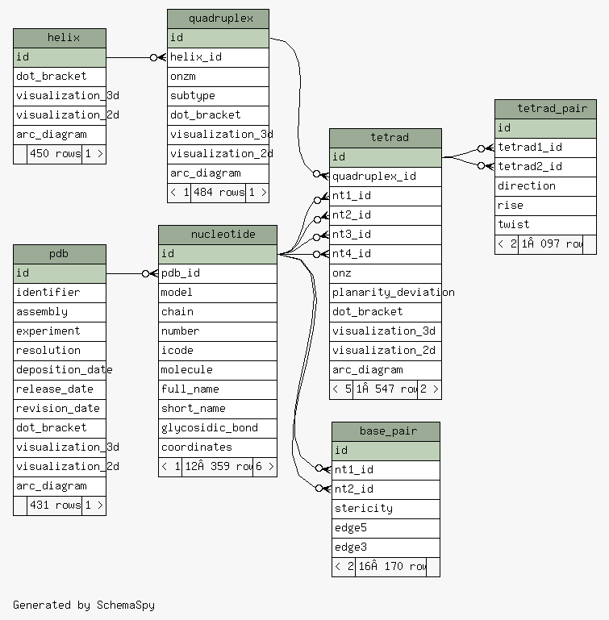

# QBASE

## Requirements

- Docker
- docker-compose
- Java 8+

## Running PostgreSQL

``` sh
docker-compose up
```

By default, PostgreSQL will be available with this config:

- Host: `localhost`
- Port: `15432`
- Schema: `public`
- User: `qbase`
- Password: `Jellux37`
- Database: `qbase`

## Schema

To update schema, please run `schemaSpy`. The result will be in `/tmp/qbase-schema`

 